# BenineEats Backend Architecture - Mermaid Diagrams

## 1. Database Entity Relationship Diagram (ERD)

```mermaid

erDiagram
    USER ||--o{ RESTAURANT : manages
    USER ||--o{ ORDER : places
    USER ||--o{ DELIVERY : drives
    USER ||--o{ DRIVER_SCHEDULE : has
    USER ||--o{ CART : owns
    RESTAURANT ||--o{ PRODUCT : contains
    RESTAURANT ||--o{ ORDER : receives
    RESTAURANT ||--o{ BANNER : displays
    RESTAURANT ||--o{ TEAM_MEMBER : employs
    RESTAURANT }o--|| CATEGORY : "has many"
    CATEGORY ||--o{ PRODUCT : categorizes
    CART ||--o{ CART_ITEM : contains
    CART_ITEM }o--|| PRODUCT : references
    ORDER ||--o{ ORDER_ITEM : contains
    ORDER_ITEM }o--|| PRODUCT : references
    ORDER }o--|| USER : "assigned to driver"
    DRIVER_SCHEDULE }o--|| USER : "for driver"
    BANNER }o--|| RESTAURANT : "optional"
    TEAM_MEMBER }o--|| RESTAURANT : "works at"
    APP_SETTINGS ||--|| APP_SETTINGS : configuration

    USER : int id PK
    USER : string username UK
    USER : string email UK
    USER : string password
    USER : string first_name
    USER : string last_name
    USER : string phone
    USER : text address
    USER : enum role
    USER : bool is_available
    USER : image avatar

    RESTAURANT : int id PK
    RESTAURANT : string name
    RESTAURANT : text description
    RESTAURANT : image image
    RESTAURANT : image cover_image
    RESTAURANT : text address
    RESTAURANT : string phone
    RESTAURANT : decimal rating
    RESTAURANT : int rating_count
    RESTAURANT : string delivery_time
    RESTAURANT : int delivery_fee
    RESTAURANT : int minimum_order
    RESTAURANT : bool is_open
    RESTAURANT : bool is_active
    RESTAURANT : int manager_id FK
    RESTAURANT : datetime created_at

    CATEGORY : int id PK
    CATEGORY : string name
    CATEGORY : string icon
    CATEGORY : image image
    CATEGORY : bool is_active
    CATEGORY : int order

    PRODUCT : int id PK
    PRODUCT : string name
    PRODUCT : text description
    PRODUCT : int price
    PRODUCT : image image
    PRODUCT : bool is_available
    PRODUCT : bool is_popular
    PRODUCT : bool is_featured
    PRODUCT : int restaurant_id FK
    PRODUCT : int category_id FK
    PRODUCT : datetime created_at

    CART : int id PK
    CART : int user_id FK UK
    CART : datetime created_at
    CART : datetime updated_at

    CART_ITEM : int id PK
    CART_ITEM : int cart_id FK
    CART_ITEM : int product_id FK
    CART_ITEM : int quantity

    ORDER : int id PK
    ORDER : string status
    ORDER : int total
    ORDER : int delivery_fee
    ORDER : text delivery_address
    ORDER : string customer_name
    ORDER : string customer_phone
    ORDER : text notes
    ORDER : int user_id FK
    ORDER : int restaurant_id FK
    ORDER : int driver_id FK
    ORDER : datetime created_at
    ORDER : datetime updated_at

    ORDER_ITEM : int id PK
    ORDER_ITEM : int order_id FK
    ORDER_ITEM : int product_id FK
    ORDER_ITEM : string product_name
    ORDER_ITEM : int product_price
    ORDER_ITEM : int quantity

    DRIVER_SCHEDULE : int id PK
    DRIVER_SCHEDULE : int driver_id FK
    DRIVER_SCHEDULE : string day
    DRIVER_SCHEDULE : bool is_enabled
    DRIVER_SCHEDULE : time start_time
    DRIVER_SCHEDULE : time end_time

    BANNER : int id PK
    BANNER : string title
    BANNER : string subtitle
    BANNER : image image
    BANNER : string link_type
    BANNER : int link_id
    BANNER : bool is_active
    BANNER : int order
    BANNER : int restaurant_id FK

    TEAM_MEMBER : int id PK
    TEAM_MEMBER : int restaurant_id FK
    TEAM_MEMBER : string name
    TEAM_MEMBER : string role
    TEAM_MEMBER : string phone
    TEAM_MEMBER : string status
    TEAM_MEMBER : datetime created_at

    APP_SETTINGS : int id PK
    APP_SETTINGS : string key UK
    APP_SETTINGS : text value
    APP_SETTINGS : string description
```

---

## 2. User Roles & Permissions Flow


---

## 3. Order Processing Flow

```mermaid
graph LR
    subgraph Client
        Browse[Browse Products]
        AddCart[Add to Cart]
        Checkout[Checkout]
    end
    
    subgraph Backend
        ValidateOrder[Validate Order]
        CreateOrder[Create Order]
        NotifyManager[Notify Manager]
    end
    
    subgraph Manager
        ViewOrder[View Order]
        Accept[Accept Order]
        Prepare[Preparing]
        Ready[Order Ready]
    end
    
    subgraph Driver
        ViewMission[View Available]
        Accept2[Accept Mission]
        PickUp[Pick Up]
        Deliver[Deliver]
    end
    
    subgraph Database
        OrderRecord[(Order Record)]
        Status[(Status Update)]
    end
    
    Browse -->|Select Items| AddCart
    AddCart -->|Confirm| Checkout
    Checkout -->|POST| ValidateOrder
    ValidateOrder -->|Valid| CreateOrder
    CreateOrder -->|Save| OrderRecord
    CreateOrder -->|Alert| NotifyManager
    NotifyManager -->|Receive| ViewOrder
    ViewOrder -->|Accept| Accept
    Accept -->|Update Status| Status
    Accept -->|pending→accepted| Prepare
    Prepare -->|Update Status| Status
    Prepare -->|→preparing| Ready
    Ready -->|Notify Driver| ViewMission
    ViewMission -->|Accept| Accept2
    Accept2 -->|→assigned| Status
    Accept2 -->|Notify Backend| PickUp
    PickUp -->|→picked_up| Status
    PickUp -->|Start Delivery| Deliver
    Deliver -->|→delivering| Status
    Deliver -->|→delivered| Status
```



---

## 4. Authentication & Token Flow


---

## 5. API Endpoint Architecture

```mermaid
graph TD
    API["API Server<br/>192.168.1.21:8000/api"]
    
    API --> Auth["🔐 Auth<br/>/auth/"]
    API --> Categories["📂 Categories<br/>/categories/"]
    API --> Restaurants["🏪 Restaurants<br/>/restaurants/"]
    API --> Products["🍔 Products<br/>/products/"]
    API --> Cart["🛒 Cart<br/>/cart/"]
    API --> Orders["📦 Orders<br/>/orders/"]
    API --> Driver["🚗 Driver<br/>/driver/"]
    API --> Manager["👨‍💼 Manager<br/>/manager/"]
    API --> Banners["🎯 Banners<br/>/banners/"]
    API --> Team["👥 Team<br/>/team/"]
    
    Auth -->|login, register, logout| AuthOps["POST/POST/POST"]
    Auth -->|refresh, profile| TokenOps["POST/GET"]
    
    Categories -->|list all| CatOps["GET"]
    
    Restaurants -->|list, detail, featured, by_category| RestOps["GET methods"]
    
    Products -->|list, detail, popular, featured, by_restaurant| ProdOps["GET methods"]
    Products -->|create, update, delete, upload| ProdWrite["POST/PATCH/DELETE"]
    
    Cart -->|get cart, manage items| CartOps["GET/POST/PUT/DELETE"]
    
    Orders -->|list, detail, create, pending, update| OrderOps["GET/POST/PATCH"]
    
    Driver -->|schedule, missions, dashboard| DriverOps["GET POST methods"]
    
    Manager -->|dashboard, restaurant, team| ManagerOps["GET/PATCH methods"]
    
    Banners -->|list, create, update, delete| BannerOps["GET/POST/PATCH/DELETE"]
    
    Team -->|list, add, update, delete| TeamOps["GET/POST/PATCH/DELETE"]
```



---

## 6. Product Management Flow


---

## 7. Driver Schedule Management

```mermaid
graph TD
    Driver[Driver] -->|View Schedule| ScheduleUI["Schedule Screen"]
    ScheduleUI -->|GET /driver/schedule/my_schedule/| FetchSchedule["Fetch 7 Days"]
    
    FetchSchedule -->|Return| ScheduleData["monday: {enabled, start, end}<br/>tuesday: {...}<br/>...sunday: {...}"]
    
    ScheduleData -->|Display| Display["Show Toggle per Day"]
    
    Display -->|Toggle Day| ToggleDay["Switch is_enabled"]
    Display -->|Change Time| ChangeTime["Edit start_time or end_time"]
    
    ToggleDay -->|POST /driver/schedule/update_day/| UpdateAPI["{ day, is_enabled }"]
    ChangeTime -->|POST /driver/schedule/update_day/| UpdateAPI2["{ day, start_time, end_time }"]
    
    UpdateAPI -->|Validate & Save| SaveDB["Update DriverSchedule"]
    UpdateAPI2 -->|Validate & Save| SaveDB
    
    SaveDB -->|Update Local State| UpdateUI["Refresh Display"]
    UpdateUI -->|Show Changes| Final["✓ Schedule Updated"]
```



---

## 8. Data Validation Pipeline

```mermaid
graph TD
    Request["Incoming Request<br/>POST/PATCH/PUT"]
    
    Request -->|Check Auth| AuthCheck["✓ JWT Valid?"]
    AuthCheck -->|Invalid| Reject1["❌ 401 Unauthorized"]
    
    AuthCheck -->|Valid| Permission["✓ Role Permission?"]
    Permission -->|Denied| Reject2["❌ 403 Forbidden"]
    
    Permission -->|Allowed| Serializer["Deserialize Data"]
    Serializer -->|Validate| Validator["Run Validators"]
    
    Validator -->|Error| ValidationError["❌ 400 Bad Request<br/>+ Error Details"]
    Validator -->|Pass| BusinessLogic["Execute Business Logic"]
    
    BusinessLogic -->|Unique Constraint| UniqueCheck{"Unique<br/>Fields?"}
    UniqueCheck -->|Duplicate| Reject3["❌ 400 Duplicate"]
    UniqueCheck -->|Valid| SaveDB["Save to Database"]
    
    SaveDB -->|Success| Serialize["Serialize Response"]
    Serialize -->|Return| Response["200 OK<br/>+ Data"]
    
    style AuthCheck fill:#90EE90
    style Permission fill:#90EE90
    style Validator fill:#90EE90
    style Response fill:#90EE90
```



---

## 9. Image Upload & Storage Flow

```mermaid
graph LR
    Mobile["Mobile App<br/>ImagePicker"] -->|Select| LocalFile["file:///path/to<br/>image.jpg"]
    
    LocalFile -->|Send FormData| CreateProduct["POST /products/"]
    CreateProduct -->|Save Details| DB1["Product Record"]
    DB1 -->|Response| ProductID["{ id: 21 }"]
    
    ProductID -->|Send Image| UploadEndpoint["POST /products/21<br/>/upload_image/"]
    UploadEndpoint -->|Validate Format| FormatCheck["JPEG/PNG/WebP?"]
    
    FormatCheck -->|Invalid| Reject["❌ Unsupported"]
    FormatCheck -->|Valid| ProcessImage["Resize & Compress"]
    
    ProcessImage -->|Save to Disk| Storage["media/products/"]
    Storage -->|Save Path| DB2["Product.image<br/>=new path"]
    
    DB2 -->|Return URL| Frontend["https://api/media<br/>/products/image.jpg"]
    
    Frontend -->|Cached| Cache["Browser Cache"]
    Cache -->|Display| Display["Show Image"]
```



---

## 10. Database Schema Relationships


---

## 11. Role-Based Access Control (RBAC)

```mermaid
graph TD
    Request["API Request"] -->|Extract Token| Token["JWT Token"]
    Token -->|Decode| Claims["User ID + Role"]
    Claims -->|Fetch User| User["User Model"]
    
    User -->|Role == ?| RoleCheck{Check Role}
    
    RoleCheck -->|client| ClientPerms["Can:<br/>• Browse<br/>• Order<br/>• View Profile"]
    RoleCheck -->|manager| ManagerPerms["Can:<br/>• Manage Restaurant<br/>• Products<br/>• Orders<br/>• Team"]
    RoleCheck -->|driver| DriverPerms["Can:<br/>• Manage Schedule<br/>• View Missions<br/>• Update Delivery"]
    RoleCheck -->|admin| AdminPerms["Can:<br/>• Full Access<br/>• All Resources"]
    
    ClientPerms -->|Check Resource| Permission{Permission<br/>Granted?}
    ManagerPerms -->|Check Resource| Permission
    DriverPerms -->|Check Resource| Permission
    AdminPerms -->|Check Resource| Permission
    
    Permission -->|✓ Yes| Execute["Execute Request"]
    Permission -->|✗ No| Deny["403 Forbidden"]
    
    Execute -->|Success| Response["200 OK"]
    Deny -->|Access Denied| Error["Error Response"]
    
    style Execute fill:#90EE90
    style Response fill:#90EE90
    style Deny fill:#FFB6C1
    style Error fill:#FFB6C1
```



---

## 12. Cache & Database Flow


